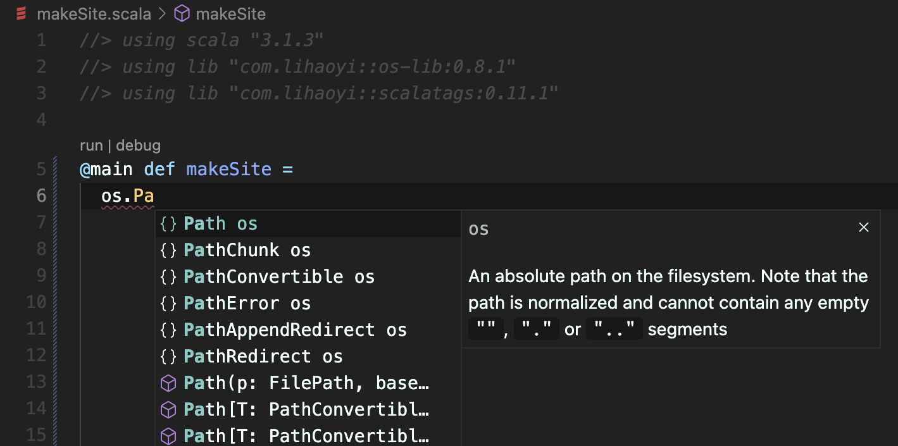

Here you are, reading my blog, but how did it come to be? and how can you do the same?

I'd say a number of factors recently came into alignment:

1. the need to create a personal website,
2. the itch to implement my own static site generator,
3. the introduction of [Scala CLI](https://scala-cli.virtuslab.org) to aid with rapid prototyping of Scala code,
   with the assistance of [VS Code](https://code.visualstudio.com) and [Metals](https://scalameta.org/metals/)
   for rich IDE features.

So in this post I will outline the inspiration and process behind creating this site and the generator behind it.

## Inspiration

Recently I was interested in making a low-configuration site generator, driven by markdown files and templates, where
templates are responsible for wrapping the markdown content in further HTML. I wanted a very flexible template language for generating websites, so I chose Scala.

For the end user, I would expose the directory structure as a single object, so the metadata and contents of each markdown file could be directly addressable as a data structure.

Each template would be a function that recieves the current markdown file's metadata and content, and also the database of all other markdown-derived data.

A markdown file should declare if it will be published as an individual html page by specifying a template in its front matter. If no template is selected then it is still exposed as data to other templates.

## A Basic Implementation

In mid 2020 I read the excellent [Hands-on Scala Programming](https://www.handsonscala.com) from [Li Haoyi](https://www.lihaoyi.com). Its a brilliant book for showcasing Scala as the ultimate tool to "get stuff done", using simple libraries that are powerful while remaining safe and accessible.

Chapters 9 and 10 of the book have the reader incrementally develop a script to generate a static blog website, with an index page of all articles, and an individual page per article.

I chose to embellish the process described in the book, with the goal to eventually build the framework for the static site generator described in the previous section.

## Getting Started

Instead of using [ammonite](https://ammonite.io) as *Hands-on Scala* suggests, I opted to drive development with [Scala CLI](https://scala-cli.virtuslab.org), giving me the most flexibility to prototype and grow the website generator.

To begin, I opened a blank file `site/makeSite.scala` and added the following:

```scala
//> using scala "3.1.3"
//> using lib "com.lihaoyi::os-lib:0.8.1"
//> using lib "com.lihaoyi::scalatags:0.11.1"

@main def makeSite = println("made site!")
```

To make sure everything is set up well, I ran the `site` directory with `scala-cli`, which detected the `makeSite` main method and executed it:

```bash
$ scala-cli run site
Compiling project (Scala 3.1.3, JVM)
Compiled project (Scala 3.1.3, JVM)
made site!
```

This initialised the `site` directory as a `scala-cli` project, making it ready to open in VS Code and get IDE features from the Metals extension.

Now, with the help of Metals, the editor recognises the `makeSite` main method, which we can run from within the editor, and it also provides *code completions* for the library dependencies we declared at the top of the file, such as `os-lib`:

{.img-fluid alt="makeSite.scala opened in VS Code, code lenses on makeSite suggest to run the script. IDE completions also suggest to use 'Path' after typing 'os.Pa'"}

## Filling in the Details

The next steps were to complete the basic implementation as detailed in the book.

I made a few changes to processing of files:
- Process markdown with [flexmark-java](https://github.com/vsch/flexmark-java), rather than commonmark-java. This gave me more flexibility, such as providing inline attributes for images in markdown.
- I also use flexmark's front matter parser on markdown files, so I can use the metadata for driving templates.
- Sample the word count for each article, to estimate read time.

I also added a lot of templates for additional parts I required for this website:
- card views for displaying links and recent articles,
- everything on the [About](/) page
- responsive sidebar,
- website footer,
- navbar,
- previous/next links for individual articles,
- displaying social links
- reading publish date, titles and other metadata from markdown front-matter.

Architecturally I made a few changes. For example, there is now a single source of truth for the directory root of markdown files. The book instead reads markdown files relative to the current working directory. This directory can change a lot depending on where the script is executed. e.g. a VS Code code lens executes from a different directory than when executing with `scala-cli` on the command line. Now, I discover the root directory at compiletime, by capturing the source-file that the main method was declared in.

## Next Steps

To take the generator further I will try to generalise the implementation to make it flexible for many use cases with minimal configuration. I plan to experiment with a journal to exercise this. Then I intend to release the generalised solution as a downloadable seed project.

## Conclusion

I had fun building this site, learning a few things about [Bootstrap](https://getbootstrap.com) in the process. I would also like to emphasise how much help `scala-cli` was in keeping me motivated to reach this milestone of a proper personal website, featuring a first written article.